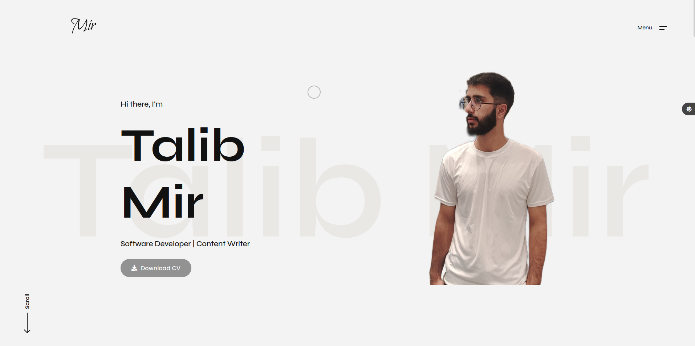

> A snapshot of my portfolio website.

## Talib Mir

🌐 [Check My Website](https://tmeerr.github.io/talibmir_portfolio/)

## About

This portfolio website is a representation of my journey, skills, and accomplishments as a Software Developer. It provides an overview of my expertise, showcases my projects, and provides a glimpse into my creative endeavors. It also serves as medium to connect with similar-minded individuals and collaborate on interesting projects.

## Features

- **Projects/Portfolio**: Explore my featured projects and get an insight into the technologies I've worked with.
- **Experience**: Learn about my professional experience and the companies I've worked with.
- **Education**: Find details about my academic background and qualifications.
- **Skills**: Discover my skill set and proficiency in various programming languages, frameworks, and tools.
- **Testimonials**: Read what my colleagues and clients have to say about me.
- **Contact**: Reach out to me for collaborations, inquiries, or just to say hello!

## Technologies Used

- HTML5
- CSS3
- JavaScript

## Plugins Used
- Font Awesome
- Google Fonts
- jQuery
- LightGallery
- Swiper
- Smooth ScrollBar 
- Normalize
- Isotope
- GSAP

## Installation

1. Clone the repository: `git clone https://github.com/tmeerr/talibmir_portfolio.git`
2. Navigate to the project directory: `cd portfolio`
3. Open the `index.html` file in your browser using liveserver
